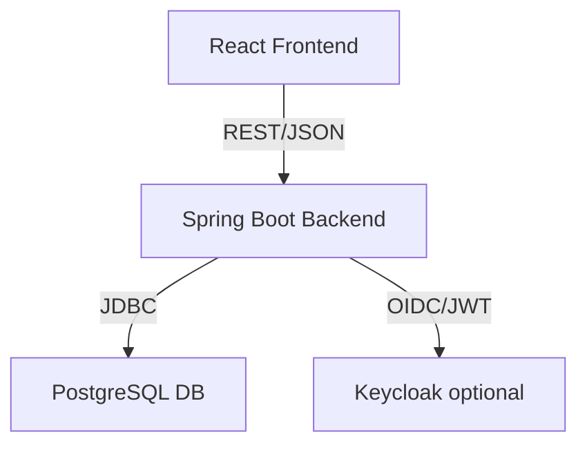

# Hahn-Software

A full-stack web application for managing people (personnes), built with React (frontend) and Spring Boot (backend), featuring JWT authentication and Keycloak integration.

---

## Table of Contents
- [Features](#features)
- [Architecture](#architecture)
- [Backend](#backend)
  - [Tech Stack](#tech-stack-backend)
  - [API Endpoints](#api-endpoints)
  - [Authentication](#authentication)
  - [Running the Backend](#running-the-backend)
- [Frontend](#frontend)
  - [Tech Stack](#tech-stack-frontend)
  - [Main Features](#main-features-frontend)
  - [Running the Frontend](#running-the-frontend)
- [Docker & Deployment](#docker--deployment)
- [Development Notes](#development-notes)
- [Repository Structure](#repository-structure)
- [Usage Examples](#usage-examples)
- [Screenshots](#screenshots)
- [Perspectives & Future Improvements](#perspectives--future-improvements)
- [License](#license)

---

## Features
- User authentication with JWT (Keycloak-ready, mock tokens for dev)
- Add, list, update, and delete people (personnes)
- Modern React UI with Redux Toolkit state management
- Protected routes and role-based access
- PostgreSQL database integration
- Dockerized for easy local development

---

## Architecture



---

## Backend

### Tech Stack (Backend)
- Java 17+
- Spring Boot
- Spring Security (JWT, OAuth2)
- Keycloak (for production)
- PostgreSQL
- Maven

### API Endpoints

#### Auth
| Method | Endpoint                  | Description         | Auth Required |
|--------|---------------------------|---------------------|--------------|
| POST   | `/api/v1/auth/login`      | User login          | No           |
| GET    | `/api/v1/auth/health`     | Health check        | No           |

#### Personne
| Method | Endpoint                        | Description                | Auth Required |
|--------|---------------------------------|----------------------------|--------------|
| GET    | `/api/v1/personnes/findAll`     | List all personnes         | Yes          |
| POST   | `/api/v1/personnes/save`        | Add a new personne         | Yes          |
| GET    | `/api/v1/personnes/{id}`        | Get personne by ID         | Yes          |
| PUT    | `/api/v1/personnes/{id}`        | Update personne by ID      | Yes          |
| DELETE | `/api/v1/personnes/{id}`        | Delete personne by ID      | Yes          |
| GET    | `/api/v1/personnes/findByNom`   | Find by name               | Yes          |
| GET    | `/api/v1/personnes/findByPrenom`| Find by first name         | Yes          |
| GET    | `/api/v1/personnes/findByEmail` | Find by email              | Yes          |
| GET    | `/api/v1/personnes/findByAge`   | Find by age                | Yes          |

### Authentication
- **Development:** Uses mock JWT tokens (`mock-jwt-token-for-user`, `mock-jwt-token-for-admin`)
- **Production:** Uses Keycloak for JWT validation (see `application.properties` and `SecurityConfig`)
- All protected endpoints require `Authorization: Bearer <token>` header

### Running the Backend
```bash
cd backend
./mvnw spring-boot:run
```
Or with Docker (see [docker-compose.yaml](docker-compose.yaml)):
```bash
docker-compose up --build
```

---

## Frontend

### Tech Stack (Frontend)
- React 18+
- Redux Toolkit
- React Router
- Material-UI (MUI)
- Fetch API

### Main Features (Frontend)
- **Authentication:** Login form, JWT storage in Redux, protected routes
- **Personne Management:** Add, list, update, delete personnes
- **Notifications:** User feedback for actions
- **Role-based UI:** (Ready for extension)
- **Reusable Components:** Navbar, ProtectedRoute, etc.

### Running the Frontend
```bash
cd frontend
npm install
npm start
```
The app will be available at [http://localhost:3000](http://localhost:3000).

---

## Docker & Deployment
- Both frontend and backend are dockerized.
- Use `docker-compose up --build` from the project root to start the full stack (backend, frontend, database, and Keycloak if configured).

---

## Development Notes
- **Redux Thunks:** All async logic (API calls) is in thunks, not in slices, to avoid circular dependencies.
- **Authentication:** The frontend automatically attaches the JWT token to all protected API requests.
- **Profiles:** The backend uses a `dev` profile for mock JWTs and a production profile for Keycloak.
- **Keycloak:** See `keycloak-config/personne-realm.json` for realm setup.

---

## Repository Structure
```
Hahn-Software/
  backend/         # Spring Boot backend
    src/
      main/
        java/com/org/backend/
          controller/   # REST controllers
          service/      # Business logic
          entity/       # JPA entities
          config/       # Security and app config
      resources/
        application.properties
    Dockerfile
    pom.xml
  frontend/        # React frontend
    src/
      features/    # Redux slices and thunks
      components/  # Shared React components
      app/         # Redux store
    Dockerfile
    package.json
  docker-compose.yaml
  keycloak-config/ # Keycloak realm config
  init.sql         # DB init script
  README.md
```

---

## Usage Examples

### 1. Login
- Go to `/signin` and use:
  - Username: `user`, Password: `user123` (user role)
  - Username: `admin`, Password: `admin123` (admin role)

### 2. Add a Personne
- Use the "Add Person" form to create a new personne.

### 3. List Personnes
- The homepage lists all personnes in the system.

### 4. Update/Delete Personne
- Use the edit/delete buttons in the list to update or remove a personne.

---

## Screenshots

### Person List
)

### Add New Person
)

### Update Person
)

---

## Perspectives & Future Improvements

- **Full JWT Implementation:** Replace mock JWT tokens with real JWT generation and validation, fully integrating with Keycloak or another OAuth2 provider for production security.
- **Role-Based Access Control:** Expand role-based UI and backend authorization for more granular permissions (e.g., admin vs. user actions).
- **Security Enhancements:** Add refresh tokens, token expiration handling, and CSRF protection for even stronger security.
- **API Documentation:** Add Swagger/OpenAPI docs for all endpoints.
- **Testing:** Add more unit and integration tests for both frontend and backend.
- **CI/CD:** Integrate automated testing and deployment pipelines.

---

## License

This project is open source and available under the [MIT License](LICENSE).

---

**Repository:** [ZbidaMohcine/Hahn-Software](https://github.com/ZbidaMohcine/Hahn-Software.git)